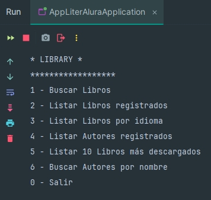

# Proyecto Biblioteca

Proyecto de biblioteca de libros desarrollado en Java usando Spring Boot y Gradle que le permite almacenar y administrar información de libros a través de una API y buscar en una base de datos PostgreSQL.

## Uso de la Aplicacion

Al iniciar la aplicación, verás un menú en la consola con las siguientes opciones:



## Documentacion

- Spring Boot Documentation: https://docs.spring.io/spring-boot/index.html
- JPA Query Methods: https://docs.spring.io/spring-data/jpa/reference/jpa/query-methods.html
- API Gutendex: https://gutendex.com
- Postman: https://www.postman.com/downloads/

## Cómo Contribuir

¡Contribuciones son bienvenidas! Si deseas mejorar este proyecto, sigue estos pasos para contribuir a través de GitHub:

1. **Fork el repositorio**:
   Haz clic en el botón "Fork" en la parte superior de la página del repositorio.

2. **Clona tu fork localmente**:

   ```bash
   git clone https://github.com/Mad-CaTs/appLiterAlura.git
   ```
3. **Crea una nueva rama para tu cambio**
   ```bash
   git checkout -b feature/nueva-funcionalidad
   ```
4. **Realiza tus cambios y haz commits descriptivos:**
   ```bash
   git commit -m "Descripción detallada de lo que has cambiado"
   ```
5. **Sube tu rama al repositorio remoto:**
   ```bash
   git push origin feature/nueva-funcionalidad
   ```
6. **Abre un Pull Request:**
   - Ve a la pestaña "Pull requests" en el repositorio original.
   - Haz clic en "New pull request" y selecciona la rama que has subido. 
   - Proporciona una descripción clara de los cambios que has hecho.
7. **Espera la revisión:** Tu Pull Request será revisado y, si todo está en orden, será fusionado con la rama principal del proyecto.


### Contacto

Si tienes alguna pregunta o sugerencia, no dudes en abrir un issue en el repositorio o contactarnos a través de markusperezch1@gmail.com.

---
